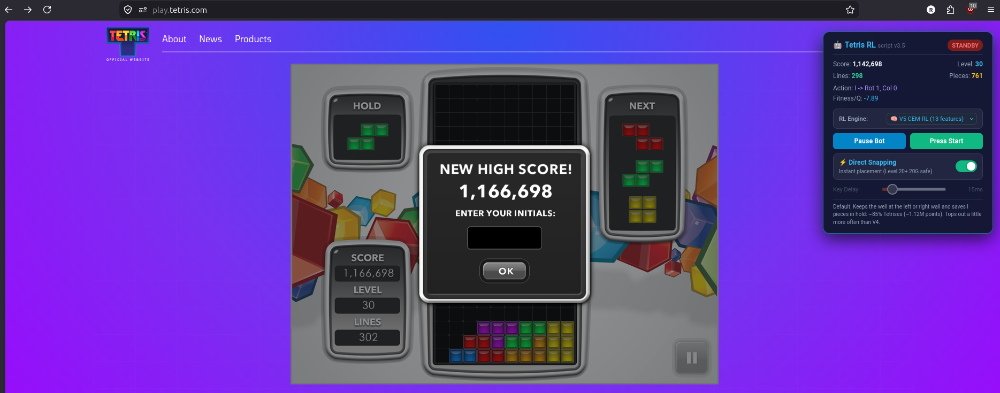

# Bot-Tetris-RL

A userscript bot that plays the official [play.tetris.com](https://play.tetris.com/) Marathon with a policy learned by reinforcement learning. It reads the game engine's state directly, plans only the placements the piece can really reach (including at 20G, where pieces drop instantly), and plays all the way to the end of the Marathon at **Level 30**.



*The bot (V5 CEM-RL) finishing the Marathon on play.tetris.com: Level 30, 302 lines, 1,166,698 points.*

### Video

[](https://youtu.be/yD0bMym39Xs)

*Click to watch the bot play on [YouTube](https://youtu.be/yD0bMym39Xs).*

## Results

| Policy | Offline game, headless Firefox | Simulated Marathon (256 games) | play.tetris.com |
| :--- | :--- | :--- | :--- |
| **CEM v5** (default, trained for score) | **1,122,478** mean over 6 games, all finished (best 1,164,644) | **1,111,898**, 3.1% topped out | **1,166,698** (Level 30, 302 lines) |
| CEM v4 | 973,409 mean over 6 games, all finished | 955,289, 1.6% topped out | |
| DQN v1 | 759,388 mean over 6 games, all finished | 756,668, 1.6% topped out | 779,912 (Level 30, 304 lines) |
| CEM v2 (trained for survival) | 600–616k, all finished | 624,104, none topped out | 600,230 (Level 30, 304 lines) |
| Before the reachable placement search | topped out at Level 20–22 | | 307,196 (Level 22) |

The Marathon ends at Level 30 / 300 lines, so once the bot survives it the score depends on how it clears lines: CEM v5 makes about 63 Tetrises per game (85% of its lines), CEM v2 almost only singles. How the Level 20 wall was found and fixed: [The 20G Gravity Breakthrough](docs/THE_20G_BREAKTHROUGH.md); how the policies compare: [RL Algorithms & Benchmarks](docs/RL_ALGORITHMS.md).

## How it works

1. **Hook the engine, not the screen.** The userscript wraps SystemJS module registration to get the game's `Player` and `Model` objects, so it reads the board, the live piece, hold and queue directly and drives the piece through the engine's own control actions.
2. **Search reachable placements.** When a piece activates, the bot runs a breadth-first search over left/right moves and SRS rotations with wall kicks. From Level 20 the fall speed is 0 ms, so the piece drops onto the stack after every action; the search models that, so the bot never plans a column the piece can't get to.
3. **Score them with a learned policy.** The default policy is linear over 13 features (Thiery & Scherrer's 8, plus five for Tetrises: the points of the clear, how many lines an I piece could clear, whether the placement clears a Tetris, how far the well is from the wall, and whether an I is in hold), trained with the **Cross-Entropy Method** to maximize the Marathon score in [`tetris_sim.py`](reinforcement-learning/src/tetris_sim.py), a simulator with the same rules and scoring as the game. The older policies (V3 and V4 CEM-RL, V1 and V2 DQN) can be picked in the HUD.
4. **Execute and verify.** Actions are applied one at a time; after each one the bot checks where the engine put the piece and re-plans if it differs, then hard-drops.

Details: [Architecture](docs/ARCHITECTURE.md) · [RL algorithms & benchmarks](docs/RL_ALGORITHMS.md).

## Quick start

### Play on play.tetris.com

1. Install [Tampermonkey](https://www.tampermonkey.net/) or [Violentmonkey](https://violentmonkey.github.io/).
2. Open [`dist/tetris_bot.user.js`](dist/tetris_bot.user.js), click **Raw**, and install it (or paste it into a new userscript).
3. Go to <https://play.tetris.com/>, keep **Direct Snapping** on in the HUD, and press **Press Start**.

### Run the offline copy of the game

The game files are not part of this repository; they live in a separate repository, included as the `tetris` submodule (cloning it needs access to that repository).

```bash
git clone --recurse-submodules git@github.com:rusminto/Bot-Tetris-RL.git
cd Bot-Tetris-RL
python3 userscript/build.py            # -> dist/tetris_bot.user.js
python3 userscript/serve_offline.py    # http://localhost:8000/, bot injected
```

### Train the policy

```bash
cd reinforcement-learning
python3 -m venv venv && source venv/bin/activate
pip install -r requirements.txt
python3 src/test_tetris_sim.py
python3 src/cem_train.py --num-workers 12    # ~40 min on 12 cores, writes cem_checkpoints/best_cem_weights.json
python3 src/evaluate_policies.py --marathon cem_checkpoints/best_cem_weights.json --dqn-v1
cd .. && python3 userscript/build.py           # embed the new weights
```

To train on a remote server, copy `.env.example` to `.env`, fill in the server, and run `reinforcement-learning/run_training_remote.sh`. See the [User Guide](docs/USER_GUIDE.md) for DQN training, the end-to-end test and troubleshooting.

## Repository layout

```
├── dist/tetris_bot.user.js        built userscript (install this)
├── userscript/
│   ├── src/                       userscript modules (placement search, hooks, policies, HUD, ...)
│   ├── build.py                   concatenates src/ and embeds the weights
│   ├── serve_offline.py           serves the offline game with the bot injected
│   └── tests/                     headless Firefox end-to-end test, JS/Python feature parity test
├── reinforcement-learning/
│   ├── src/                       simulators, CEM and DQN training, evaluation
│   ├── cem_checkpoints/           CEM weights used by the userscript (v5), v4, v3, v2 survival and v1 legacy
│   ├── checkpoints*/              DQN checkpoints, weights_v1.json / weights_v2.json exports
│   ├── logs/                      training logs
│   └── run_training_remote.sh     sync + train on a remote server (configured by .env)
├── docs/                          architecture, algorithms, the 20G write-up, user guide
├── screenshots/                   screenshots and recordings
└── tetris/                        submodule: offline copy of the game (separate repository)
```

## Documentation

| Document | Contents |
| :--- | :--- |
| [User Guide](docs/USER_GUIDE.md) | Installing, the HUD, offline game, building, testing, training, troubleshooting |
| [Architecture](docs/ARCHITECTURE.md) | Engine hooks, engine facts (actions, gravity, lock delay), placement search, simulators, build |
| [RL Algorithms & Benchmarks](docs/RL_ALGORITHMS.md) | CEM and DQN, features, training setup, measured results |
| [The 20G Gravity Breakthrough](docs/THE_20G_BREAKTHROUGH.md) | Why the bot died at Level 20 and how it was fixed |

## Disclaimer

This project is for educational purposes only: it was built to learn and demonstrate reinforcement learning on a real game. Don't use it to submit scores to leaderboards or competitions, or in any way that breaks the game's terms of service.

Tetris® is a registered trademark of The Tetris Company. This is a personal research project, not affiliated with or endorsed by The Tetris Company or Blue Planet Software, and it does not include their game files.
