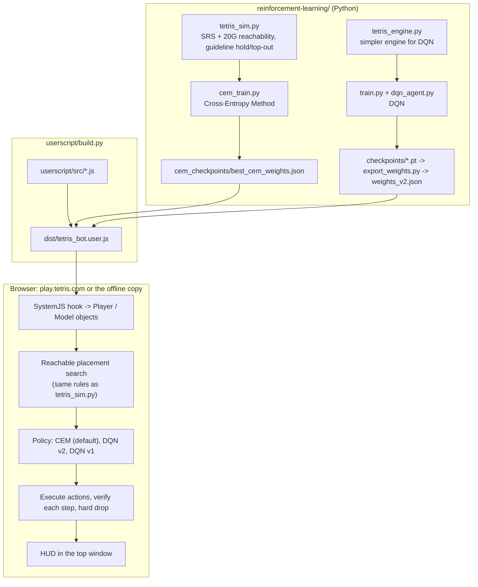
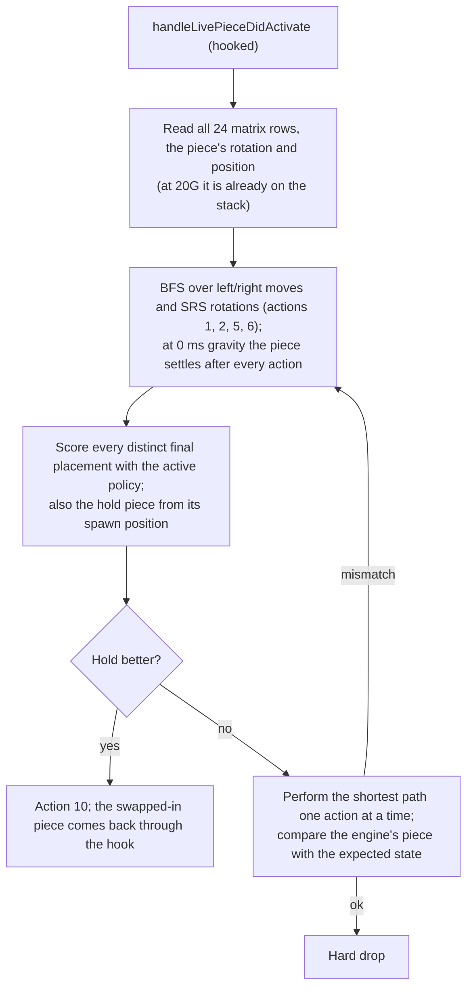

# Architecture

The project has two halves: a **userscript** that plays inside the game's own JavaScript engine, and a **Python training stack** that learns the policy the userscript uses. A small build step joins them.

---

## 1. Inside the game

### Hooking the engine

play.tetris.com is a Cocos Creator app whose modules are loaded by SystemJS and heavily minified. Rather than reading pixels or the DOM, the userscript (`userscript/src/game_hooks.js`) runs at `document-start` and wraps `System.register`: every module's `declare` function is wrapped so each exported class can be inspected as it is registered.

- A class whose prototype has `constructMatrix` is the **Player**. `startGame`, `constructMatrix` and `lockLivePieceIntoMatrix` are wrapped to capture the instance (`window.__tetrisPlayer`). It exposes `getMatrix()`, `getLivePiece()`, `getHoldPiece()`, `getPieceQueue()` and `isGameActive()`.
- A class with `forceHardDropControlAction` is the **Model** (piece control). `handleLivePieceDidActivate` is wrapped to place each new piece synchronously, and `performControlAction(action)` is how the bot moves pieces.
- A class with `addKeyEventListeners` is the input adapter; together with the engine's key-code converter it lets the keystroke mode send key presses through the engine's own input path.
- If the hooks miss the player (e.g. the script loaded late), the bot searches the Cocos scene graph for a component that owns it.

### Engine facts (measured in the live engine)

| What | Value |
| :--- | :--- |
| Matrix | 10 wide × 24 high: 20 visible rows + 4 hidden rows above; y = 0 is the bottom row |
| Spawn | Top two visible rows (y = 18–19), SRS rotation box at column 3 (O at column 4), spawn orientation |
| Rotation | Standard SRS shapes and kick tables |
| Hold | Once per piece. `model.canHoldLivePiece()` tells whether it is available (`player.canHoldLivePiece` does not exist). After a hold the swapped-in piece activates a few frames later |

`model.performControlAction(id)`:

| id | Action | id | Action |
| :-: | :--- | :-: | :--- |
| 1 | move left | 6 | rotate CCW with SRS kicks (`superRotateCCW`) |
| 2 | move right | 7 / 8 | start / stop soft drop |
| 3 | rotate CW, no kicks | 9 | hard drop |
| 4 | rotate CCW, no kicks | 10 | hold |
| 5 | rotate CW with SRS kicks (`superRotateCW`) | | |

Gravity (`mNormalFallSpeedMSEC`) and lock delay (`mLockTimeMSEC`) per level, read while the bot played a full game:

| Level | 1 | 2 | 3 | 4 | 5 | 6 | 7 | 8 | 9 | 10 | 11 | 12 | 13 | 14 | 15 | 16 | 17 | 18 | 19 |
| :--- | --: | --: | --: | --: | --: | --: | --: | --: | --: | --: | --: | --: | --: | --: | --: | --: | --: | --: | --: |
| Fall (ms/row) | 1000 | 793 | 618 | 473 | 355 | 262 | 190 | 135 | 94 | 64 | 43 | 28 | 18 | 11 | 7 | 4 | 3 | 2 | 1 |
| Lock (ms) | 500 | 500 | 500 | 500 | 500 | 500 | 500 | 500 | 500 | 500 | 500 | 500 | 500 | 500 | 500 | 500 | 500 | 500 | 500 |

| Level | 20 | 21 | 22 | 23 | 24 | 25 | 26 | 27 | 28 | 29 | 30 |
| :--- | --: | --: | --: | --: | --: | --: | --: | --: | --: | --: | --: |
| Fall (ms/row) | **0** | 0 | 0 | 0 | 0 | 0 | 0 | 0 | 0 | 0 | 0 |
| Lock (ms) | 450 | 400 | 350 | 300 | 250 | 200 | 195 | 184 | 167 | 151 | 150 |

The Marathon ends at Level 30 / 300 lines. At 0 ms the engine drops the piece to the stack **inside** `handleLivePieceDidActivate` and again after every successful move or rotation, which is what the placement search has to model.

### Direct Snapping: placing a piece

`userscript/src/placement_search.js` and `instant_placement.js`, run from the activation hook in the same call stack:

Mismatches are logged to the console (`[TetrisRL] Engine disagreed with the SRS model`) and counted in `window.__tetrisBotStats` in the game iframe. None have been observed in thousands of placements.

### Keystroke mode

With Direct Snapping off, a 20 ms polling loop (`bot_loop.js`) plans with the straight-drop planners in `policies.js` and sends key presses with a configurable delay (10–60 ms) through the engine's input path, falling back to DOM keyboard events. It is meant for watching the bot move like a player; it can't keep up with 20G. The same loop also handles a piece the activation hook didn't place.

### HUD and frames

play.tetris.com runs the game in an iframe. The script runs in every frame (`@allFrames`); the iframe instance plays and posts telemetry to the top window with `postMessage`, and the top window hosts the HUD (`hud.js`) and sends commands back (pause, engine, start, Direct Snapping, key delay).

---

## 2. Training side

### `tetris_sim.py`: the CEM simulator

A bitboard simulator that follows the same rules as the browser search, so the policy is trained on exactly the choices it gets in the game:

- the matrix, spawn position and SRS kick tables above;
- **20G reachability** from Level 20: the piece settles after spawning and after every action, so it can only slide along the stack or kick upward; below Level 20 any placement reachable at spawn height is allowed (the bot moves the piece before gravity acts);
- hold once per piece, block out when the spawn cells are occupied, lock out when a piece locks entirely above the visible rows;
- play.tetris.com's scoring (read from the game's score component): 100/300/500/800 × level for 1–4 lines, ×1.5 for a back-to-back Tetris, +50 × combo × level, perfect-clear bonuses, 2 points per hard-dropped row; T-spins are not modelled;
- a Marathon mode (Level 1 → 300 lines);
- the same policy inputs as the userscript: the CEM features and the DQN features over the visible rows, and the same penalty for minos left in the hidden rows (`userscript/tests/features_parity.js` checks them against each other on random boards).

`test_tetris_sim.py` checks the features against the original numpy implementation and the spawn positions against the live engine.

### `tetris_engine.py`: the DQN environment

The original simulator used for DQN. It has the correct gravity and lock delay tables, a 7-bag, hold, and a rough kinematic check (the piece falls while it is shifted at a fixed key delay). It has no SRS kicks, and at 0 ms gravity it lets the piece move freely along the top instead of dropping it, so DQN policies are not trained for 20G.

### Training scripts

| Script | Purpose |
| :--- | :--- |
| `cem_train.py` | CEM policy search over the linear policy (see [RL Algorithms](RL_ALGORITHMS.md)) |
| `evaluate_policies.py` | Compare CEM weight files and the DQN networks on the same simulated games (e.g. `--marathon`) |
| `train.py`, `dqn_agent.py` | DQN v2 training (6 features), TensorBoard logs in `runs/` |
| `evaluate.py`, `web_viewer.py` | Play a DQN checkpoint in the terminal or in a live browser view |
| `export_weights.py` | Export a DQN checkpoint to the JSON the userscript embeds |

---

## 3. Build

`userscript/build.py` concatenates the modules in `userscript/src/` into one IIFE and replaces three placeholders with the weights:

| Placeholder | Source |
| :--- | :--- |
| `__CEM_WEIGHTS__` | `reinforcement-learning/cem_checkpoints/best_cem_weights.json`, or `--cem-weights` (8 or 10 weights, normalized; falls back to the published Thiery & Scherrer weights) |
| `__DQN_V2_WEIGHTS__` | `reinforcement-learning/weights_v2.json` |
| `__DQN_V1_WEIGHTS__` | `reinforcement-learning/weights_v1.json` |

The result is `dist/tetris_bot.user.js`. `userscript/serve_offline.py` serves the offline game from the `tetris/` submodule and injects that file into `game.html`, so the game files are never modified.
