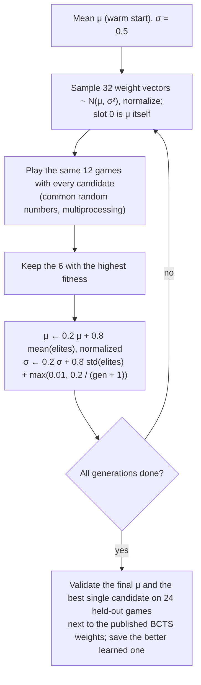

# RL Algorithms & Benchmarks

All engines play the same way: for every placement the piece can reach (see [Architecture](ARCHITECTURE.md#direct-snapping-placing-a-piece)), lock it on a copy of the board, clear lines, compute features of the resulting board (the *after-state*) and pick the placement with the highest value. The hold piece's placements are scored too. The engines differ in what they value and how that function is learned.

## Summary

| | **CEM v3** (default) | CEM v2 | DQN v1 | DQN v2 |
| :--- | :--- | :--- | :--- | :--- |
| Learns | Linear weights, by direct policy search | Linear weights | After-state value, MLP | After-state value, MLP |
| Objective | **Marathon score** | Survival (lines before topping out) | Rewards: 10/30/60/100 per clear | Same as v1, + level bonus |
| Features | 10 (8 Thiery & Scherrer + 2 Tetris features) | 8 | 4 | 6 |
| Trained in | `tetris_sim.py`: Marathon, hold, 40 generations, ~35 min on 12 cores | `tetris_sim.py`: 20G, 10 rows, no hold | Earlier `tetris_engine.py` | `tetris_engine.py`, 5,000 episodes, ~8 h |
| Simulated Marathon, 256 games | **826,041 ± 47,155**, topped out 3/256 | 606,165 (64 games), topped out 0/64 | 729,646 ± 101,514, topped out 6/256 | topped out 24/24 at ~159 lines |
| Offline game, headless Firefox | **826,296 ± 41,414 (6 games, all finished)** | 600–616k (all finished) | 759,388 ± 18,284 (6 games, all finished) | topped out 3/3 at Level 17–18 |
| Clears per game (singles / doubles / triples / Tetrises) | 72 / 31 / 4.6 / **37.9** | 253 / 23 / 0.5 / 0 | 30 / 93 / 17.3 / 6.8 | |

Simulated numbers come from `src/evaluate_policies.py --marathon`, offline-game numbers from `userscript/tests/e2e.js`; every browser run logged 0 mismatches between planned and actual piece positions. The simulator reproduces the browser closely (same scores and the same mix of clears for every engine), so it is used for training and for large comparisons.

On play.tetris.com, CEM v2 completed the Marathon with 600,230 points and DQN v1 with 779,912. The shipped userscript (3.2, CEM v3) then scored 905,040 and 906,122 in two more offline games, and also finished a game with 0 ms gravity forced from the first piece (758,900 points).

### Which one to use

- **CEM v3** (default): highest score and fewer top-outs than DQN v1 in the Marathon. It builds for Tetrises, so its stack sits higher (often 5–12 rows) and it is less robust if 20G lasts the whole game (3/32 simulated games topped out when 20G started at the first piece, against 0/32 for CEM v2 and DQN v1).
- **CEM v2** (`cem_checkpoints/best_cem_weights_v2_survival.json`): the safest, never topped out in testing, but ~27% fewer points; it clears almost everything as singles.
- **DQN v1**: between the two on score, but tops out more often than CEM v3.

---

## 1. CEM: Cross-Entropy Method policy search

### A. Policy

$$V(s) = \mathbf{w}^\top \mathbf{f}(s), \qquad \lVert \mathbf{w} \rVert = 1$$

Only the direction of $\mathbf{w}$ matters for choosing a placement, so weights are kept normalized. The userscript accepts 8 weights (v1/v2) or 10 (v3).

### B. Features

Computed over the 20 visible rows after the piece locks and lines clear. Features 1–8 are Thiery & Scherrer's; 9–10 were added in v3 so a linear policy can plan Tetrises:

| # | Feature | Definition |
| :-: | :--- | :--- |
| 1 | Landing height | Mean height of the piece's four cells, counted from the floor (bottom row = 1) |
| 2 | Eroded piece cells | Lines cleared × cells of this piece that were in the cleared lines |
| 3 | Row transitions | Filled/empty changes along each row, walls counted as filled |
| 4 | Column transitions | Filled/empty changes down each column, empty above the top, filled floor |
| 5 | Holes | Empty cells with a filled cell somewhere above in the same column |
| 6 | Cumulative wells | Well cells are empty with filled (or wall) on both sides; a vertical run of $d$ well cells adds $1 + 2 + \dots + d$ |
| 7 | Hole depth | For each hole, the number of filled cells above it in its column, summed |
| 8 | Rows with holes | Rows that contain at least one hole |
| 9 | Clear points | Base points of this clear / 100: 0, 1, 3, 5, 8 for 0–4 lines |
| 10 | Ready lines | Lines a vertical I would clear in the lowest column right now (0–4): the rows directly above that column's top that are full except for it |

Placements that leave cells in the 4 hidden rows above the visible area get a −1000 penalty; placements entirely above it (lock out) are never chosen. `userscript/tests/features_parity.js` checks that the userscript and the simulator compute identical features.

### C. Algorithm (`cem_train.py`)

The held-out validation matters: in the v3 run the best single candidate (a lucky sample) scored 783k but topped out in 6 of 24 games, while the final mean scored 836k with no top-outs.

### D. Objectives and training settings

Games run in [`tetris_sim.py`](../reinforcement-learning/src/tetris_sim.py): the same rules as the browser search (SRS kicks, 20G reachability from Level 20, hold once per piece, guideline block out/lock out) and play.tetris.com's scoring, read from the game's score component and checked against recorded games:

| Clear | Points |
| :--- | :--- |
| Single / double / triple / Tetris | 100 / 300 / 500 / 800 × level |
| Back-to-back Tetris | ×1.5 |
| Combo | +50 × combo count × level |
| Perfect clear | +800 / 1200 / 1800 / 2000 (3200 for a back-to-back Tetris) × level |
| Hard drop | 2 per row |

`python3 src/cem_train.py --objective score` (default, v3) and `--objective lines` (v2):

| | **score** (v3) | lines (v2) |
| :--- | :--- | :--- |
| Game | Marathon: Level 1 → 300 lines, 20 rows, hold | 20G from the first piece, 10 rows, no hold, cap 3,000 pieces |
| Fitness | Mean score − 500,000 per top-out | Mean lines cleared |
| Features | 10 | 8 |
| Start | v2 weights + 0.3 on features 9 and 10 | Hand-set signs |
| Generations | 40 | 30 |

Why the lines objective uses a harder game: on the real board with hold, decent survival policies never top out, so every candidate scores the same and CEM can't tell them apart. The score objective doesn't have that problem: points differ even when everyone survives.

Warm-starting matters for the score objective: the same run started from the hand-set signs plateaued at ~726k, against 836k from the v2 weights. Both runs are deterministic for a given `--seed`; the defaults reproduce the shipped v3 weights exactly.

**v1 history.** The first CEM run used a simplified game inside `cem_train.py`: no gravity, a hold bug that let the held piece be reused forever, and a piece cap (rising from 550 to 3,400 over the run) that every candidate hit from generation 1 (its reported 1,359 lines was the cap: 3,400 pieces × 0.4). With no difference between candidates CEM only drifted, and the v1 weights ended up *worse* than its starting point (`logs/cem_v1_train.log`).

### E. Learned weights

**v3** (`cem_checkpoints/best_cem_weights.json`, `logs/cem_v3_train.log`):

| Landing height | Eroded cells | Row trans. | Col. trans. | Holes | Wells | Hole depth | Rows w/ holes | Clear points | Ready lines |
| --: | --: | --: | --: | --: | --: | --: | --: | --: | --: |
| −0.522 | −0.203 | −0.179 | −0.498 | −0.361 | −0.016 | −0.055 | −0.411 | −0.002 | **+0.321** |

Compared with v2, clearing lines is no longer rewarded at all (eroded cells turned negative, clear points ≈ 0), wells are barely penalized, and rows that an I could clear are rewarded. The result keeps a well open and fills the rows beside it, so roughly half of its lines come from Tetrises.

**v2** (`cem_checkpoints/best_cem_weights_v2_survival.json`, `logs/cem_v2_train.log`):

| Landing height | Eroded cells | Row trans. | Col. trans. | Holes | Wells | Hole depth | Rows w/ holes |
| --: | --: | --: | --: | --: | --: | --: | --: |
| −0.249 | 0.312 | −0.292 | −0.250 | −0.466 | −0.210 | −0.110 | −0.648 |

The v1 weights are kept in `cem_checkpoints/best_cem_weights_v1_legacy.json`.

### F. Survival benchmarks (v1 vs v2)

Fresh games, all at 20G (`python3 src/evaluate_policies.py cem_checkpoints/best_cem_weights_v2_survival.json cem_checkpoints/best_cem_weights_v1_legacy.json --bcts` reproduces the first row):

| Setting | v1 weights | **v2 weights** | BCTS (published) |
| :--- | :--- | :--- | :--- |
| 10 rows, no hold, 40 games, 3,000-piece cap | 69 lines, 40/40 topped out | **653 lines**, 32/40 topped out | 481 lines, 36/40 topped out |
| 20 rows, no hold, 16 games, 5,000-piece cap | 284 lines, **16/16 topped out** | ~1,997 lines (cap), 0/16 topped out | ~1,998 lines (cap), 0/16 topped out |
| 8 rows, hold, 24 games, 3,000-piece cap | 983 lines, 9/24 topped out | **1,156 lines**, 4/24 topped out | 906 lines, 9/24 topped out |

---

## 2. DQN v2 (6 features)

### A. Features

Lines cleared, holes, bumpiness $\sum_{c=0}^{8} |h_c - h_{c+1}|$, total height $\sum_c h_c$, maximum height $\max_c h_c$, and normalized level $(\min(30, \text{level}) - 1) / 29$.

### B. Training (`train.py`, `dqn_agent.py`)

- **Network:** MLP 6 → 64 → 64 → 1 with ReLU, Xavier init. It estimates the value of an after-state.
- **Target:** $r + \gamma \, V_{\theta^-}(s'_{\text{best}})$, where $s'_{\text{best}}$ is the greedy after-state for the next piece and $\theta^-$ is a target network synced every 10 episodes. Mean squared error, Adam (lr $10^{-3}$), gradient clipping at 1.0, replay buffer 30,000, batch 512, $\gamma = 0.99$.
- **Exploration:** ε-greedy from 1.0 to 0.01, ×0.995 per episode.
- **Reward:** +1 per piece; 10 / 30 / 60 / 100 for 1–4 lines; 15 × level on level-up; −20 on game over.
- **Environment:** `tetris_engine.py` (correct gravity/lock tables and 7-bag, but no SRS kicks and no 20G reachability).

The 5,000-episode run (`logs/dqn_v2_train.log`) ended at about 150–160 lines per game (Level 16; best 161 lines).

### C. In the game

DQN v2 tops out at Level 17–18, before 20G, both in the browser (3/3 games) and in the simulator (24/24). It never saw a level above 16 during training, so its "normalized level" input is outside the training range from Level 17 on; that is the most likely cause, but it hasn't been verified.

---

## 3. DQN v1 (4 features)

The first DQN: lines cleared, holes, bumpiness and total height, MLP 4 → 64 → 64 → 1. It was trained with an earlier version of `train.py`/`tetris_engine.py` (checkpoints in `checkpoints_v1_legacy/`, TensorBoard logs in `runs_v1_legacy/`); the current `train.py` trains v2. Its reward grows faster than linearly with lines cleared, which is why it prefers doubles and triples and scored more than CEM v2. With the reachable placement search and hold it completes the Marathon in the browser (6/6 offline games, 779,912 points on play.tetris.com), but tops out in about 2% of simulated Marathons.
