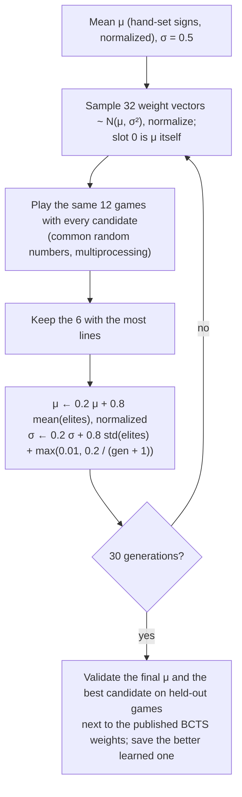

# RL Algorithms & Benchmarks

All three engines play the same way: for every placement the piece can reach (see [Architecture](ARCHITECTURE.md#direct-snapping-placing-a-piece)), lock it on a copy of the board, clear lines, compute features of the resulting board (the *after-state*) and pick the placement with the highest score. The hold piece's placements are scored too. The engines differ in what they score and how that function is learned.

## Summary

| | **CEM** (default) | DQN v2 | DQN v1 |
| :--- | :--- | :--- | :--- |
| Learns | Linear weights, by direct policy search | After-state value, MLP | After-state value, MLP |
| Features | 8 (Thiery & Scherrer) | 6 | 4 |
| Model | $V(s) = \mathbf{w}^\top \mathbf{f}(s)$ | 6 → 64 → 64 → 1 | 4 → 64 → 64 → 1 |
| Trained in | `tetris_sim.py`: 20G, 10 rows, no hold; 30 generations, ~12 min on 12 cores | `tetris_engine.py`, 5,000 episodes, ~8 h on CPU | An earlier version of `tetris_engine.py`/`train.py` |
| Offline game, reachable placement search | **Marathon completed in every run** (301, 302 lines; 300 with 0 ms gravity forced) | Topped out 3/3 at Level 17–18 (160–172 lines) | Marathon completed 3/3 (304–309 lines) |
| play.tetris.com | **Marathon completed** (304 lines, 600,230 points) | | |

Offline numbers come from `userscript/tests/e2e.js` (headless Firefox on the offline copy of the game); every run logged 0 mismatches between the planned and the actual piece positions. With so few games per engine, treat them as indicative.

---

## 1. CEM: Cross-Entropy Method policy search

### A. Policy

$$V(s) = \mathbf{w}^\top \mathbf{f}(s) = \sum_{k=1}^{8} w_k f_k(s), \qquad \lVert \mathbf{w} \rVert = 1$$

Only the direction of $\mathbf{w}$ matters for choosing a placement, so weights are kept normalized.

### B. Features (Thiery & Scherrer)

Computed over the 20 visible rows after the piece locks and lines clear:

| # | Feature | Definition |
| :-: | :--- | :--- |
| 1 | Landing height | Mean height of the piece's four cells, counted from the floor (bottom row = 1) |
| 2 | Eroded piece cells | Lines cleared × cells of this piece that were in the cleared lines |
| 3 | Row transitions | Filled/empty changes along each row, walls counted as filled |
| 4 | Column transitions | Filled/empty changes down each column, empty above the top, filled floor |
| 5 | Holes | Empty cells with a filled cell somewhere above in the same column |
| 6 | Cumulative wells | Well cells are empty with filled (or wall) on both sides; a vertical run of $d$ well cells adds $1 + 2 + \dots + d$ |
| 7 | Hole depth | For each hole, the number of filled cells above it in its column, summed |
| 8 | Rows with holes | Rows that contain at least one hole |

Placements that leave cells in the 4 hidden rows above the visible area get a −1000 penalty; placements entirely above it (lock out) are never chosen.

### C. Algorithm (`cem_train.py`)

### D. Training environment

Games run in [`tetris_sim.py`](../reinforcement-learning/src/tetris_sim.py), which has the same rules as the browser search: SRS rotation with kicks, **20G reachability from Level 20** (the piece settles onto the stack after every action, so it can only slide along the stack or kick upward), hold once per piece, and guideline block out/lock out.

The defaults are deliberately harder than the real game, so that candidates actually differ:

| Setting | Default | Why |
| :--- | :--- | :--- |
| Start level | 20 (20G from the first piece) | 20G is where the bot used to die |
| Board height | 10 rows | On 20 rows, good policies never top out within an affordable piece cap |
| Hold | off | Hold makes games far longer; a policy that survives without it is stronger with it |
| Games per candidate | 12, the same games for every candidate | Game lengths vary a lot; shared games reduce noise |
| Piece cap | 3,000 per game | Keeps a generation under a minute |

**v1 history.** The first CEM run used a simplified game inside `cem_train.py`: no gravity, a hold bug that let the held piece be reused forever, and a piece cap (rising from 550 to 3,400 over the run) that every candidate hit from generation 1 (its reported 1,359 lines was the cap: 3,400 pieces × 0.4). With no difference between candidates CEM only drifted, and the v1 weights ended up *worse* than its starting point (`logs/cem_v1_train.log`).

### E. Learned weights (v2)

`cem_checkpoints/best_cem_weights.json`, from `logs/cem_v2_train.log`:

| Landing height | Eroded cells | Row trans. | Col. trans. | Holes | Wells | Hole depth | Rows w/ holes |
| --: | --: | --: | --: | --: | --: | --: | --: |
| −0.249 | 0.312 | −0.292 | −0.250 | −0.466 | −0.210 | −0.110 | −0.648 |

The v1 weights are kept in `cem_checkpoints/best_cem_weights_v1_legacy.json`.

### F. Simulator benchmarks

Fresh games, all at 20G (`python3 src/evaluate_cem.py ... --bcts` reproduces the first row):

| Setting | v1 weights | **v2 weights** | BCTS (published) |
| :--- | :--- | :--- | :--- |
| 10 rows, no hold, 40 games, 3,000-piece cap | 69 lines, 40/40 topped out | **653 lines**, 32/40 topped out | 481 lines, 36/40 topped out |
| 20 rows, no hold, 16 games, 5,000-piece cap | 284 lines, **16/16 topped out** | ~1,997 lines (cap), 0/16 topped out | ~1,998 lines (cap), 0/16 topped out |
| 8 rows, hold, 24 games, 3,000-piece cap | 983 lines, 9/24 topped out | **1,156 lines**, 4/24 topped out | 906 lines, 9/24 topped out |

---

## 2. DQN v2 (6 features)

### A. Features

Lines cleared, holes, bumpiness $\sum_{c=0}^{8} |h_c - h_{c+1}|$, total height $\sum_c h_c$, maximum height $\max_c h_c$, and normalized level $(\min(30, \text{level}) - 1) / 29$.

### B. Training (`train.py`, `dqn_agent.py`)

- **Network:** MLP 6 → 64 → 64 → 1 with ReLU, Xavier init. It estimates the value of an after-state.
- **Target:** $r + \gamma \, V_{\theta^-}(s'_{\text{best}})$, where $s'_{\text{best}}$ is the greedy after-state for the next piece and $\theta^-$ is a target network synced every 10 episodes. Mean squared error, Adam (lr $10^{-3}$), gradient clipping at 1.0, replay buffer 30,000, batch 512, $\gamma = 0.99$.
- **Exploration:** ε-greedy from 1.0 to 0.01, ×0.995 per episode.
- **Reward:** +1 per piece; 10 / 30 / 60 / 100 for 1–4 lines; 15 × level on level-up; −20 on game over.
- **Environment:** `tetris_engine.py` (correct gravity/lock tables and 7-bag, but no SRS kicks and no 20G reachability).

The 5,000-episode run (`logs/dqn_v2_train.log`) ended at about 150–160 lines per game (Level 16; best 161 lines).

### C. In the game

DQN v2 topped out at Level 17–18 in all three offline games, before 20G. It never saw a level above 16 during training, so its "normalized level" input is outside the training range from Level 17 on; that is the most likely cause, but it hasn't been verified.

---

## 3. DQN v1 (4 features)

The first DQN: lines cleared, holes, bumpiness and total height, MLP 4 → 64 → 64 → 1. It was trained with an earlier version of `train.py`/`tetris_engine.py` (checkpoints in `checkpoints_v1_legacy/`, TensorBoard logs in `runs_v1_legacy/`); the current `train.py` trains v2. With the reachable placement search and hold it completed the Marathon in all three offline games (304–309 lines).
