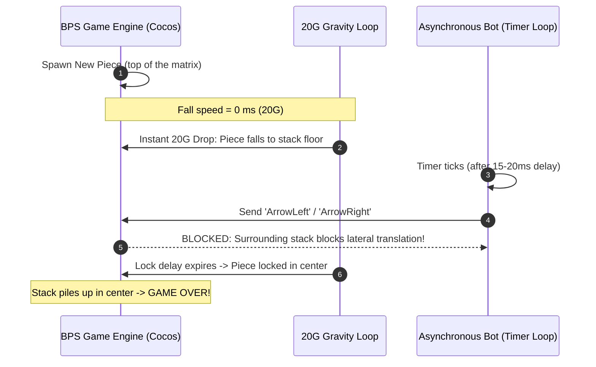
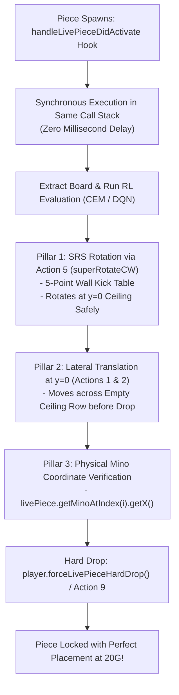

# The 20G Gravity Breakthrough

A detailed engineering case study on how we identified, reverse-engineered, and conquered the infamous **20G instantaneous gravity barrier** on the official [play.tetris.com](https://play.tetris.com/) client.

It happened in two stages:
1. **Stage 1 — synchronous execution** (below): moving the bot into the engine's piece-activation hook took it from dying at the start of 20G to **Level 22 with 212 lines (307,196 points)**, but it still topped out at Level 20–22.
2. **[Stage 2 — reachable placement search](#stage-2-why-the-bot-still-died-at-level-20)**: at 0 ms gravity the engine drops the piece *before* the hook runs, so the bot now plans only placements the piece can actually reach. It **completes the whole Marathon (Level 30, 300 lines)**, even with 20G forced from the first piece.

---

## 🛑 The Problem: The Level 19/20 Death Trap

Up to Level 18, our autonomous agent easily dismantled the game with near-perfect boards. However, the moment the game reached **Level 19 or Level 20**, the agent abruptly topped out within 2 to 3 pieces, regardless of board cleanliness.

Recordings of the live gameplay revealed a stark symptom:
> *Pieces were spawning at the top of the board and instantly dropping to the stack in 1 frame. The bot attempted to rotate and move the piece after it had already landed, but surrounding blocks trapped the piece, leading to an immediate top-out.*



---

## 🔍 Root Cause Analysis

### 1. The Physics of 20G Gravity
In guideline Tetris, gravity at Level 20 drops to **0 milliseconds per row** (`mNormalFallSpeedMSEC = 0`). This phenomenon is termed **20G**:
- A tetromino falls 20 rows in a single physics frame.
- The piece does **not** float down row-by-row; it spawns and instantaneously contacts the surface directly below it.

### 2. The Asynchronous Polling Flaw
Earlier versions of the userscript relied on a browser polling interval:
```javascript
// FLAWED: Asynchronous timer loop
setInterval(executeBotMove, 20); // 20ms delay is an eternity at 20G!
```
Even with a 15ms or 20ms interval, JavaScript's event loop executes tasks asynchronously. By the time `setInterval` triggered `executeBotMove`, the Cocos engine's internal physics step had already executed its 20G drop. The piece was already seated on the floor or atop a high stack before the first keystroke could be dispatched.

### 3. Basic Rotation vs SRS Wall Kicks
When the bot attempted to rotate pieces, it initially dispatched **Action 3 (`rotateCW`)**. In the BPS engine:
- `Action 3` is a rudimentary rotation without wall kicks.
- At spawn height (the top rows of the matrix), rotating long pieces (such as the 4-long `I`-piece or `T`-piece) requires kick offsets because the piece's bounding box intersects the board ceiling or walls.
- Because `Action 3` lacked kick offsets, the rotation was rejected by the engine, leaving the piece in its initial orientation.

---

## 🛠️ The 3-Pillar Solution

To achieve superhuman play at 20G, we re-architected the bot's execution pipeline into a **synchronous, SRS-compliant placement engine**:



---

### Pillar 1: Synchronous Hook at Piece Activation
By reverse-engineering the Cocos Creator `Model` prototype, we identified the exact method called when a piece spawns: `handleLivePieceDidActivate`. 

We hooked this method directly:
```javascript
// Intercepting live piece activation synchronously
const origActivate = ModelProto.handleLivePieceDidActivate;
ModelProto.handleLivePieceDidActivate = function() {
    origActivate.apply(this, arguments);
    if (botEnabled && snapMode) {
        // EXECUTE IMMEDIATELY IN THE EXACT SAME CALL STACK
        // BEFORE ANY GRAVITY TICK CAN DROP THE PIECE!
        executeInstantPlacement(this);
    }
};
```
Because `executeInstantPlacement` runs in the same synchronous frame, the piece is still at its spawn height, where no stack blocks lateral translation.

> **Correction (Stage 2):** this holds only while the fall speed is above 0 ms, i.e. up to Level 19 (1 ms). At Level 20+ the engine drops the piece inside `handleLivePieceDidActivate` itself, so it is already on the stack when the hook runs. See [Stage 2](#stage-2-why-the-bot-still-died-at-level-20).

---

### Pillar 2: Super Rotation System (SRS) Wall Kicks
We replaced basic rotation with the engine's internal SRS-compliant methods:
- **Action 5**: `superRotateCW` (Clockwise with 5-point SRS kick table)
- **Action 6**: `superRotateCCW` (Counter-Clockwise with SRS kick table)

```javascript
function rotatePieceToTarget(model, livePiece, pieceName, targetRot) {
    const orientations = PIECES[pieceName];
    if (!orientations || orientations.length <= 1) return true;

    for (let attempt = 0; attempt < 4; attempt++) {
        const curFacing = livePiece.getFacing();
        const curRot = curFacing % orientations.length;
        if (curRot === targetRot) return true;

        // Perform SRS Action 5 with full wall kick support
        model.performControlAction(5, null, null);
    }
    return false;
}
```
Now, even when an `I`-piece or `T`-piece spawns against the ceiling, the engine tests all 5 SRS kick offsets and rotates successfully.

---

### Pillar 3: Physical Mino Coordinate Tracking & Snapping
Tetromino bounding boxes vary by orientation and shape (e.g., an `I`-piece rotates in a $4 \times 4$ box, whereas an `O`-piece sits in a $2 \times 2$ box). Relying on bounding box origins resulted in occasional 1-column offsets.

To guarantee zero-error alignment, we implemented direct querying of the piece's constituent minos:
```javascript
function getPieceLeftCol(livePiece) {
    let minX = 999;
    const count = livePiece.getNumMinos ? livePiece.getNumMinos() : 4;
    for (let i = 0; i < count; i++) {
        const mino = livePiece.getMinoAtIndex(i);
        if (mino && typeof mino.getX === 'function') {
            const x = mino.getX();
            if (x < minX) minX = x;
        }
    }
    return minX !== 999 ? minX : 3;
}
```
The bot shifts the piece horizontally until `getPieceLeftCol(livePiece) === targetX`, and only then triggers **Action 9 (`hardDrop`)**.

> Stage 2 replaced this: the bot now reads the piece's full rotation and position after every action and compares it with the planned path, instead of shifting until the left column matches and ignoring blocked moves.

---

## 🏆 Stage 1 Results

With the synchronous spawn hook and SRS Action 5 enabled, the bot got past the immediate top-out at the start of 20G:
- **Max Level**: **Level 22**
- **Lines Cleared**: **212 lines**
- **Score**: **307,196 points**

It still topped out there, though: at Level 20+ the stack would suddenly pile up around the spawn columns (see `screenshots/cem-rl-3-last.mp4` and `screenshots/cem-rl-3-last-2.mp4`, both recorded with Direct Snapping on).

---

## Stage 2: Why the bot still died at Level 20

### The gravity table, measured in the live engine

Reading `model.mNormalFallSpeedMSEC` while the bot played through every level:

| Level | 1 | 2 | 3 | 4 | 5 | 6 | 7 | 8 | 9 | 10 | 11 | 12 | 13 | 14 | 15 | 16 | 17 | 18 | 19 | **20–30** |
| :--- | --: | --: | --: | --: | --: | --: | --: | --: | --: | --: | --: | --: | --: | --: | --: | --: | --: | --: | --: | --: |
| Fall speed (ms/row) | 1000 | 793 | 618 | 473 | 355 | 262 | 190 | 135 | 94 | 64 | 43 | 28 | 18 | 11 | 7 | 4 | 3 | 2 | 1 | **0** |

Level 19 is still 1 ms per row, which is why the bot played Level 19 perfectly and fell apart within seconds of Level 20.

### The engine drops the piece before the hook runs

In the game code (`assets/main/index.js`), the Model's activation handler ends by starting the fall:

```javascript
// Model.handleLivePieceDidActivate (de-minified)
this.mGameState.handleLivePieceDidActivate();
this.startLivePieceFalling(true);

// Model.startFallTimer
this.mFallTimerRemainingMSEC = this.getCurrentFallSpeedMSEC();
if (this.mFallTimerRemainingMSEC == 0) this.processFallTimer(0);  // drops until the piece touches down
```

The userscript calls the original handler first and only then runs `executeInstantPlacement`, so at 0 ms the piece is already resting on the stack. Driving the engine headlessly confirmed it: with the fall speed forced to 0, the piece is on the stack when the hook returns, and after every successful move or rotation it drops again.

The old executor then rotated, tried to shift towards a column picked by a straight-drop planner, ignored the failed shifts when a taller column was in the way, and hard-dropped wherever the piece had stopped. Every misplaced piece made the next one more likely to be blocked, so the stack piled up around the spawn columns within about 40 pieces.

### The fix: search only reachable placements

`userscript/src/placement_search.js` and `userscript/src/instant_placement.js` (built into `dist/tetris_bot.user.js` by `userscript/build.py`):

1. **Read the real state.** Board rows (all 24, including the 4 hidden rows), the live piece's rotation and position from its minos, and whether the current fall speed is 0.
2. **Breadth-first search** over left, right, SRS rotate CW/CCW (actions 5/6, the kick tables verified against the engine). At 0 ms gravity the piece settles after every action, so it can only slide along the stack or climb with kicks; above 0 ms it moves at spawn height. Every distinct final placement keeps the shortest action path to it.
3. **Score every reachable placement** with the active engine (CEM, DQN v2 or DQN v1), and the hold piece's placements from its spawn position.
4. **Execute step by step.** After each action the bot compares the engine's piece with the expected state; on a mismatch it re-plans from where the piece actually is. Only then does it hard drop.
5. **Hold correctly.** `player.canHoldLivePiece` does not exist (so the old check was always true); the bot now uses `model.canHoldLivePiece()`. The swapped-in piece activates a few frames later and comes back through the hook.

### Stage 2 results

On **play.tetris.com** the shipped build completed the Marathon: **Level 30, 304 lines, 600,230 points** (screenshot in the [README](../README.md)).

Headless Firefox on the offline copy of the game (`userscript/tests/e2e.js`):

| Run | Original executor, v1 weights | Placement search, v1 weights | **Placement search, v2 weights** |
| :--- | :--- | :--- | :--- |
| Fall speed forced to 0 ms and lock delay to 150 ms from the first piece | topped out after 15 s, 13 lines | 154 lines in 90 s, still playing (run stopped) | **completed the Marathon: 300 lines, 588,050 points, stack never above 5 rows** |
| Normal game from Level 1 | dies at Level 20–22 | completed the Marathon: 300 lines, 659,316 points | **completed the Marathon: 302 lines, 614,228 points** |

The Marathon ends at Level 30 / 300 lines; every placement-search run that played to the end finished it with the stack at most 3 rows high, and all runs logged **0 mismatches** between the SRS model and the engine. (Score differences come from how often a policy goes for multi-line clears; none of them optimize score.)

The v2 weights come from retraining CEM in a simulator with the same 20G rules. They have since been replaced as the default by v3 and then v4, trained for Marathon score (about 955k points on average in the simulator instead of ~624k); see [RL Algorithms](RL_ALGORITHMS.md#d-objectives-and-training-settings).
